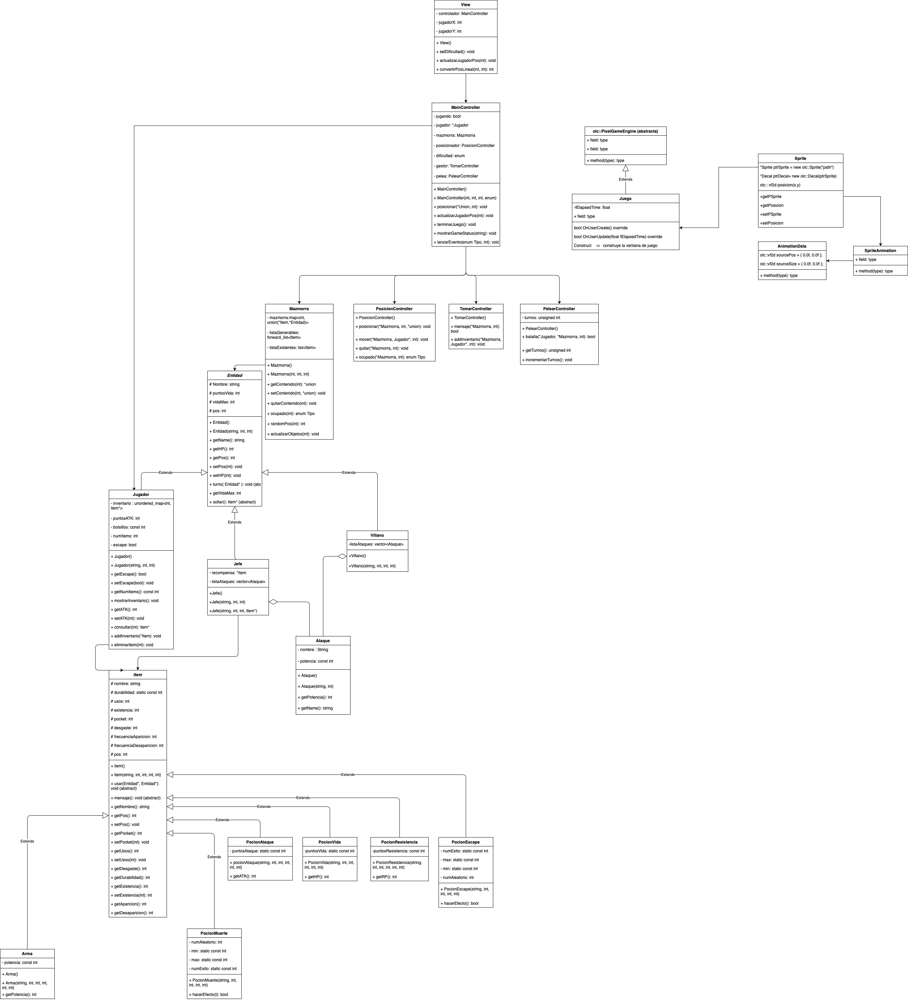

# JUEGO
Como estudiantes del curso de POO (Pogramacion Orientada a Objetos), nos pusimos en el reto de diseñar y codificar un videojuego a partir de unas instrucciones que nos brindo la profesora como proyecto para el curso. **Aqui esta el resultado**
***
* [Documentation](#documentation)
* [Purpose & General Info](#philosophy)
  * [History](#history)
  * [More info](#info)
  * [Class Diagram](#uml)
* [Wiki](https://github.com/idkwhattoputkk/catch-em-now/wiki)
* [Auto Evaluacion](#Evaluaciones)

## Documentation

## Philosophy
El segundo proyecto de *POO* es un juego de pelea por turnos que nos toca desarrollar como estudiantes conformando grupos de maximo 4 estudiantes, con el proposito de poner a prueba las diferentes tematicas vistas en el curso codificando dicho proyecto.

### History
El pacífico reino de Cyradil fue golpeado por una maldición que hizo que la gente
cayera enferma, esto pone al reino en un terrible peligro de ser invadido por reinos
enemigos. El caballero Herz, que en el momento de la maldición se encontraba por
fuera del reino, es el único capaz de salvar el reino de la perdición, para esto deberá
buscar un legendario artefacto perdido en las mazmorras del norte para
purificar al reino de Cyradil de la maldición.

### Info
Puedes encontrar mas informacion con presicion [aqui.](https://sway.office.com/5lfiMzez5y7Q6kMz)
> dale un vistazo.

### Uml

## Evaluciones