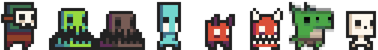
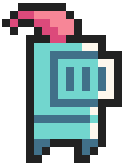

# JUEGO
Como estudiantes del curso de POO (Pogramacion Orientada a Objetos), nos pusimos en el reto de diseñar y codificar un videojuego a partir de unas instrucciones que nos brindo la profesora como proyecto para el curso. **Aqui esta el resultado**
***
* [Documentation](#documentation)
  * [Armas](#weapons)
  * [Villanos](#villains)
  * [Pociones y recompensas](#potions) 
  * [Mecanicas](#mechanics)
* [Purpose & General Info](#philosophy)
  * [History](#history)
  * [More info](#info)
  * [Class Diagram](#uml)
* [Auto Evaluacion](#evaluciones)
* [Wiki](https://github.com/idkwhattoputkk/Proyecto_poo_2/wiki)

## Documentation
Es un juego basado en [C++](https://en.wikipedia.org/wiki/C%2B%2B), utilizando herencia, **POO** (Programacion Orientada a Objetos), sobreescritura y sobrecarga  principalmente en las clases que heredan de Entidad e Item.
### Weapons
Para el combate cuerpo a cuerpo y a turnos, decidimos utilizar armas basadas en estos combates, como lo son lanzas, cuchillos, dagas, etc. esto para dar un ambiente mas a peleas de este estilo que requiere el juego en vez del estilo *"shooter"*. Ademas, estas armas son quienes le brindaran un *boost* de daño para derrotar a los enemigos que impidan culminar la cruzada de nuestro caballero con exito.
### Villains
Los villanos se clasifican en dos tipos, **normales** y **jefes**, los jefes son mas fuertes que los normales e indican que esta finalizando el nivel, estos villanos son quienes se encargaran de combatir y hacerle la vida imposible a nuestro heroe. ***algo de la logica en la siguiente imagen***.

### Potions
En cuanto a las pociones decidimos tener 5 pociones de las cuales 2 de esas cuentan con un mecanimos de aletoriedad para hacer efecto (*"suerte"*). Las otras 3 restantes haran efecto apenas sean usadas. Ademas se incluyo una recompensa que puede obtener en alguna ubicacion del mapa. Estas pociones le ayudaran a nuestro caballero en su cruzada para salvar su reino, cada una tiene una funcion unica y especial.
***algo de la logica en la siguiente imagen***.

###  Mechanics
Las mecanicas para utilizar las dos pociones con *"suerte"* o aleatoriedad las cuales son ***Pocion de muerte*** y ***Pocion de escape***, se basan en un rango entre dos numeros fijos y un numero al azar generado por codigo que si es esta en este rango y ademas es mayor o igual a un numero **X** fijo definido previamente esta hara efecto, de lo contrario no funcionara.
## Philosophy
El segundo proyecto de *POO* es un juego de pelea por turnos que nos toca desarrollar como estudiantes conformando grupos de maximo 4 estudiantes, con el proposito de poner a prueba las diferentes tematicas vistas en el curso codificando dicho proyecto.

### History
El pacífico reino de Cyradil fue golpeado por una maldición que hizo que la gente
cayera enferma, esto pone al reino en un terrible peligro de ser invadido por reinos
enemigos. El caballero Herz, que en el momento de la maldición se encontraba por
fuera del reino, es el único capaz de salvar el reino de la perdición, para esto deberá
buscar un legendario artefacto perdido en las mazmorras del norte para
purificar al reino de Cyradil de la maldición.

### Info
Puedes encontrar mas informacion con presicion [aqui.](https://sway.office.com/5lfiMzez5y7Q6kMz)
> dale un vistazo.

### UML

## Evaluciones
> TODO!